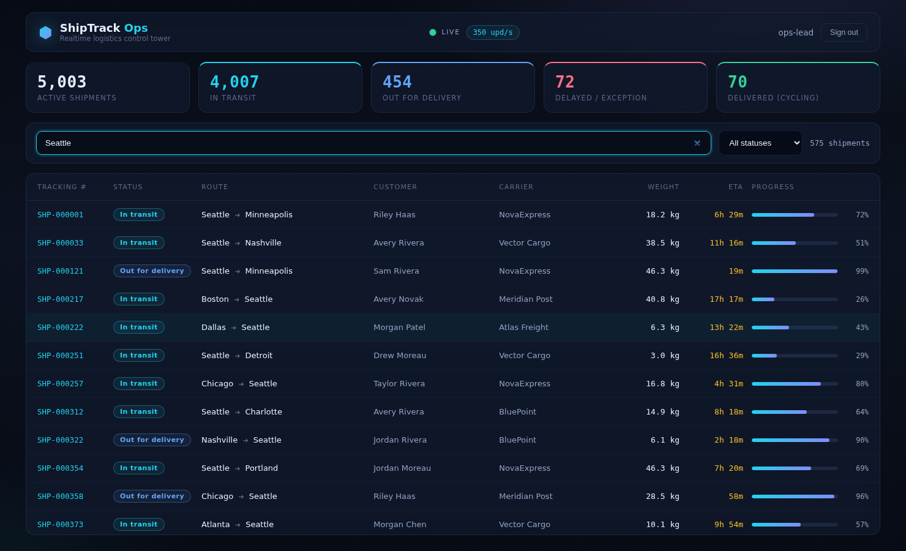

# ShipTrack Ops — Realtime Logistics Dashboard (Angular 18 + .NET 8)

[](https://github.com/mauri0686/realtime-logistics-dashboard-angular/actions/workflows/ci.yml) [](LICENSE)

A full‑stack, real‑time operations dashboard: a **.NET 8** backend streams live updates for
**5,000 shipments** over **SignalR (WebSocket)** to an **Angular 18** control‑tower UI that stays
smooth by rendering only what's visible.

> Sister project: the same backend with a **React 19** front‑end →
> [`realtime-logistics-dashboard-react`](https://github.com/mauri0686/realtime-logistics-dashboard-react)


> 🚀 **[Live demo → mauri0686.github.io/realtime-logistics-dashboard-angular](https://mauri0686.github.io/realtime-logistics-dashboard-angular/)** — sign in with any username/password. The demo runs the shipment simulation in your browser; clone the repo to run the real .NET + SignalR backend.

> 🧭 **New to the project?** Read the [plain-language guide](docs/CLIENT-GUIDE.md) — no engineering background needed.



## Architecture

```
┌───────────────────────┐      REST   GET /api/shipments  (snapshot)   ┌────────────────────────────┐
│      Angular 18       │  ─────────────────────────────────────────►  │    LogisticsTracker.Api    │
│      localhost:4200   │      WS     /hubs/shipments                  │    .NET 8  ·  :5080        │
│                       │  ◄═════════════════════════════════════════  │    REST + SignalR + JWT    │
└───────────────────────┘      "ShipmentsUpdated" deltas every 1s      └────────────────────────────┘
        JWT bearer ── POST /api/auth/login (demo: any non-empty credentials)
```

**The real‑time pattern:** REST answers the request/response question ("what is the fleet *now*?");
the WebSocket answers the push question ("what changed *since*?"). The client merges 350 delta
rows/second into an in‑memory `Map` and projects one new immutable array per tick.

## Why this is fast at 5,000 live rows

| Technique | Where |
|---|---|
| **CDK virtual scroll** — only ~30 visible rows exist in the DOM | `shipments-table.component.html` |
| **`trackBy` on stable ids** — delta batches re-render only changed rows | `shipments-table.component.ts` |
| **`OnPush` everywhere + immutable rows** — change detection is a reference check | all components |
| **One WebSocket, app-wide** — connection lives in a root singleton service, never per component | `shipments.service.ts` |
| **Debounced search** (RxJS `debounceTime` → signal) — filtering runs on quiet keystrokes only | `dashboard.component.ts` |

## Angular practices showcased

- **Standalone components** + lazy `loadComponent` routes (login/dashboard ship as separate bundles)
- **Signals** (`signal`, `computed`) for synchronous state; **RxJS** for async edges (`debounceTime`,
  `distinctUntilChanged`, `toSignal` interop)
- **Functional HTTP interceptor** (`HttpInterceptorFn`) — attaches JWT, centralises 401 handling
- **Functional route guard** (`CanActivateFn`) — redirects anonymous users, preserves `returnUrl`
- **Typed reactive forms** (`NonNullableFormBuilder`) with declarative validation
- **Smart/dumb component split** — container owns state; presentational children get inputs only
- **Signal inputs** (`input.required<T>()`) on presentational components
- **Leak-safe subscriptions** — `takeUntilDestroyed`, async-pipe-free signal reads, explicit
  socket teardown on route leave
- **Unit tests** — `TestBed`, `HttpTestingController`, guard tests via `runInInjectionContext`

## Run it

Prereqs: .NET SDK 8, Node 20+.

```bash
# 1. backend
cd backend/LogisticsTracker.Api
dotnet run --urls http://localhost:5080        # Swagger at /swagger

# 2. frontend
cd frontend-angular
npm install
npm start                                       # http://localhost:4200
```

Log in with **any** non‑empty username/password (e.g. `ops-lead` / `demo123`) — auth is a demo JWT
flow so the interceptor/guard pattern runs against a genuinely protected API (REST **and** the
WebSocket handshake via `access_token`).

```bash
# unit tests (headless Chrome)
cd frontend-angular && npm test -- --watch=false
```

## Backend notes (.NET 8)

- Minimal API + `MapHub<ShipmentsHub>` — REST and WebSocket share the same JWT auth scheme
- `BackgroundService` + `PeriodicTimer` drives the simulation and broadcasts deltas via
  `IHubContext` — clients never poll
- In‑memory, deterministic demo data (no database, no external services) — clone & run
